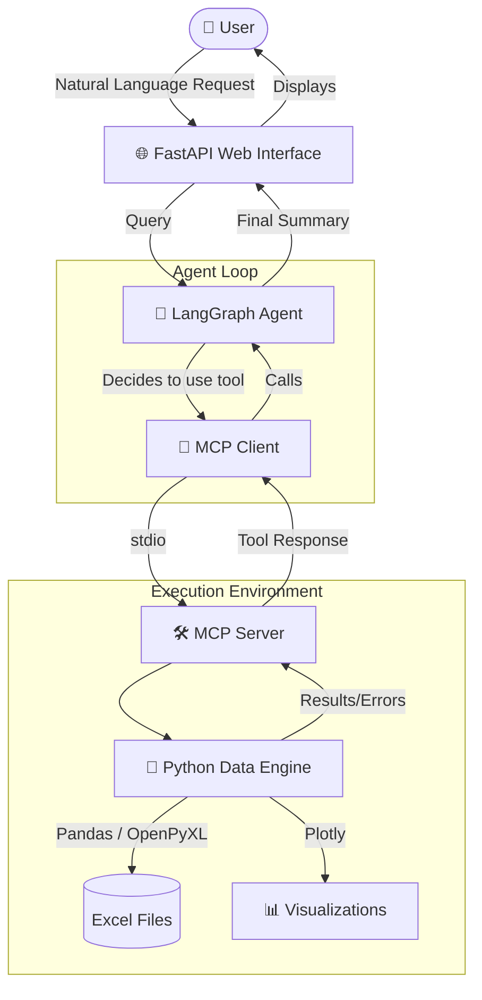
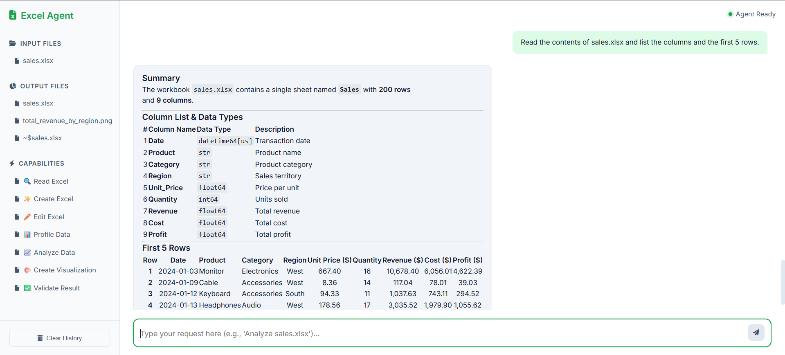
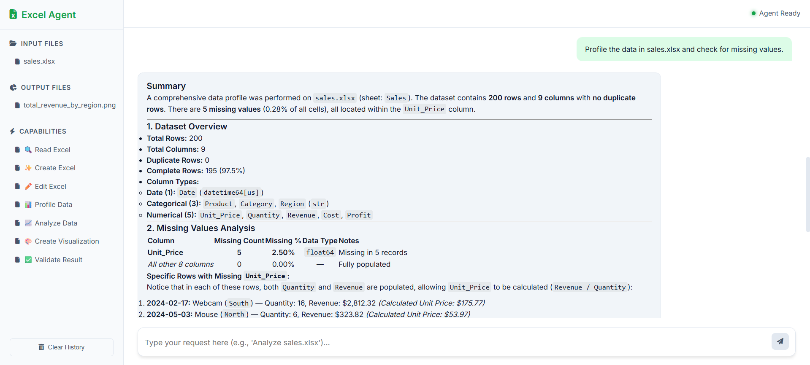
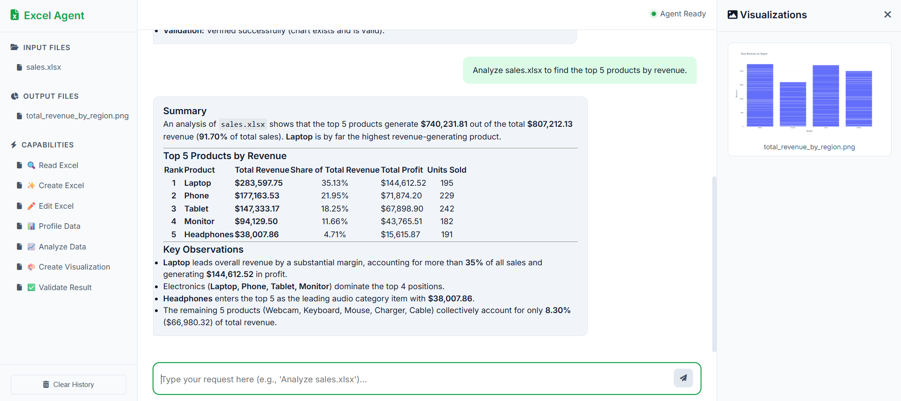
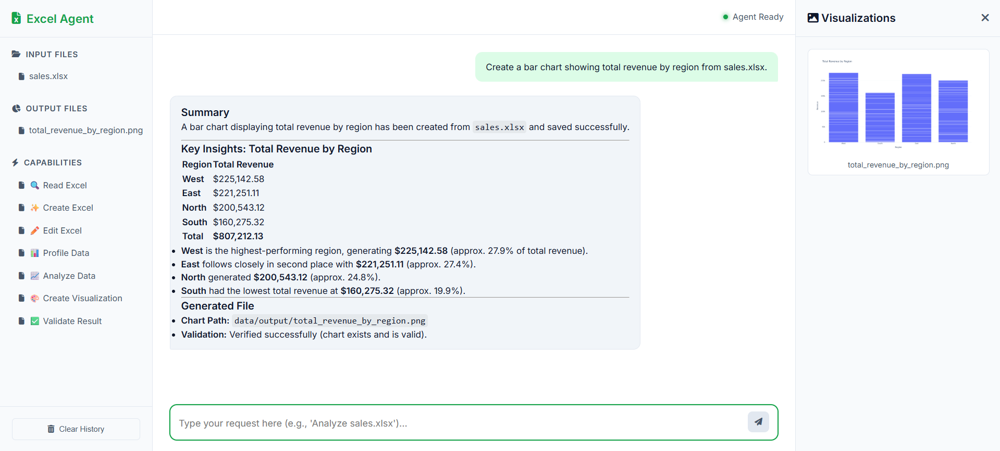
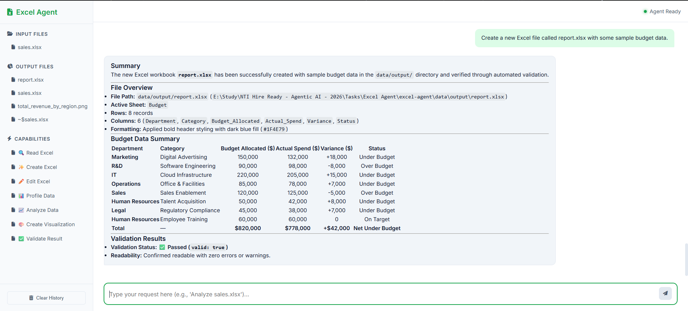
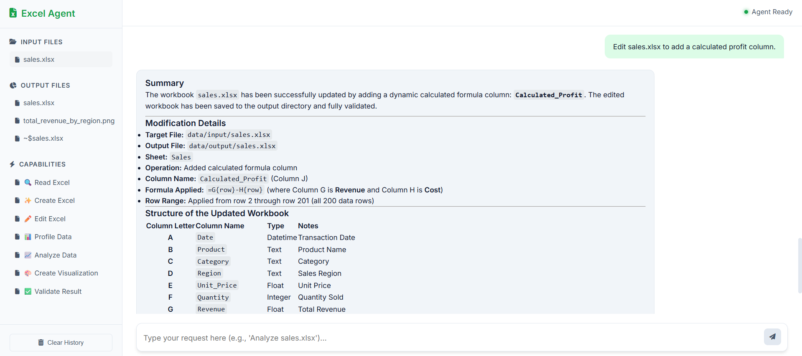
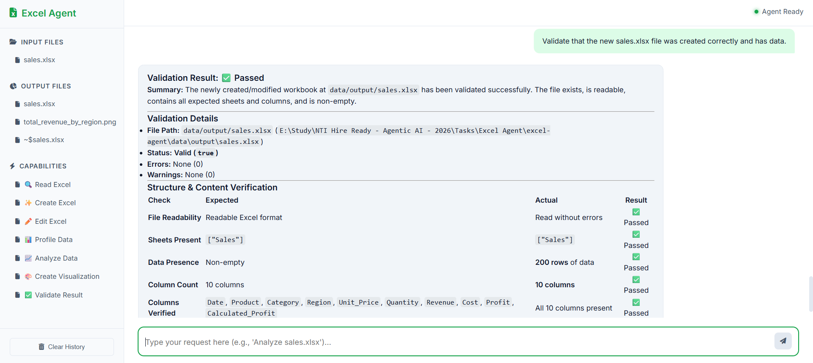

# 📊 Agentic Excel Intelligence System

Welcome to the **Agentic Excel Intelligence System**! 🚀 This is a natural-language AI agent powered by **LangGraph**, **MCP**, and **Google Gemini** (with failover support for OpenRouter/Groq).

Instead of wrestling with complex Excel formulas, pivot tables, or chart generation, you simply **ask questions in plain English**. The system automatically reads, profiles, analyzes, visualizes, and even modifies your Excel data!

---

## 🏗️ How It Works (Architecture Flow)

Our system is built on a clean, decoupled architecture using the Model Context Protocol (MCP) to separate the reasoning agent from the powerful Python execution engine.



---

## 📸 Screenshots & Capabilities

Here is a glimpse of what the agent can do, straight from our beautiful custom web interface!

### 🔍 Read Data
The agent can intelligently read and extract information from your spreadsheets.



### 📊 Profile Data
Instantly generate statistical profiles, check for missing values, and understand your data distributions.



### 📈 Analyze Data
Ask complex analytical questions, and the agent will group, aggregate, and calculate the exact answers.



### 🎨 Create Visualizations
The agent uses Plotly to generate beautiful, accurate charts (Bar, Line, Scatter, Pie, etc.) which appear instantly in the visualization dashboard.




### ✨ Create Excel Files
Need a template or a new dataset? The agent can generate brand new, fully populated Excel files for you.



### ✏️ Edit & Validate
Add calculated columns, filter rows, and update cells. The agent always validates its work to ensure the Excel files are correctly saved!






---

## 🚀 Setup & Installation

### 1. Create Virtual Environment
```bash
python -m venv venv

# Windows
.\venv\Scripts\activate
# Mac/Linux
source venv/bin/activate
```

### 2. Install Dependencies
```bash
pip install -r requirements.txt
```

### 3. Configure API Keys
Edit the `.env` file or create a `gemini_keys.txt` file in the root directory.
* The system supports **Gemini API Key Rotation** — just paste one key per line in `gemini_keys.txt` and the agent will auto-rotate them if one runs out of quota!
* Alternatively, use OpenRouter or Groq via the `.env` file.

### 4. Run the Web Server!
```bash
python server.py
```
Then open your browser to **[http://localhost:8000](http://localhost:8000)** to interact with the agent!

---

## 🛠️ Available MCP Tools

| Tool | Description |
|---|---|
| `read_excel` | Read workbook sheets, columns, and data |
| `create_excel` | Create new workbooks with formatted data |
| `edit_excel` | Add columns, formulas, update cells |
| `profile_data` | Get data profile (types, missing values, stats) |
| `analyze_data` | Aggregation, grouping, trends, correlations, outliers |
| `create_visualization` | Line, bar, scatter, histogram, box, pie, heatmap |
| `validate_result` | Verify output files and results |
